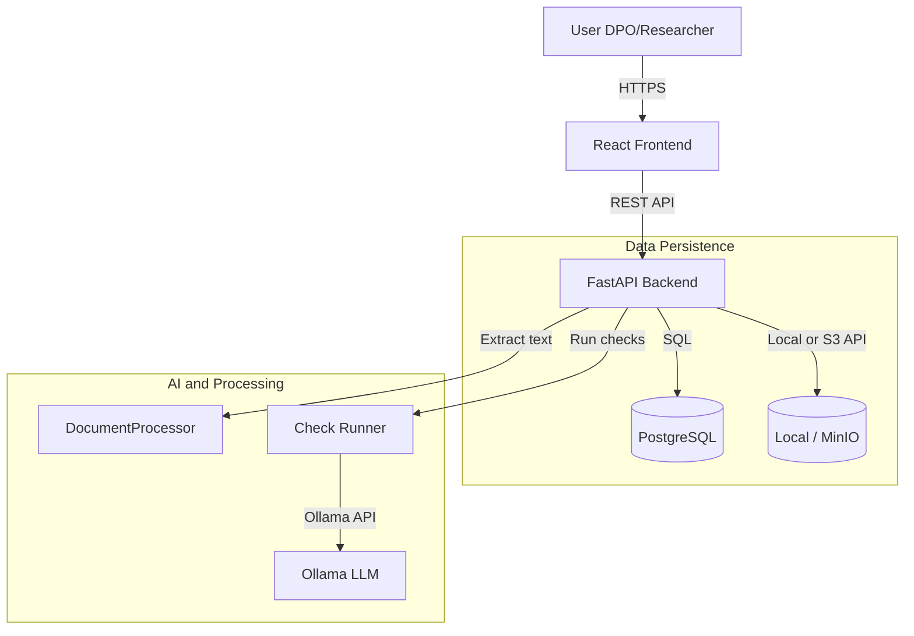

# System Architecture

## Technology Stack

The project follows a modern, containerized architecture (monolithic backend, separate frontend).

| Component | Technology | Description |
| :--- | :--- | :--- |
| **Frontend** | React (Vite) | SPA with Tailwind CSS and Radix UI. |
| **Backend** | FastAPI (Python) | REST API: business logic, DB, storage, LLM orchestration. |
| **Database** | PostgreSQL | Cases, Documents, Findings, Playbooks. |
| **Storage** | Local / MinIO (S3) | Configurable in `backend/app/storage.py`; object storage for document files. |
| **LLM Runtime** | Ollama | Local inference (e.g. Llama 3, Mistral); URL/model via env. |
| **AI Framework** | PydanticAI | Structured prompts and outputs in `backend/app/core/llm.py` and `services/check_runner.py`. |
| **Task Queue** | Celery + Redis | Planned for async extraction and long-running checks. |

## High-Level Data Flow

## Core Components

### 1. Case Service
*   **Location**: `backend/app/api/routes/cases.py`
*   **Entities**: `Case` (status, department, case_type, language, etc.), `ActivityLog` (Audit-Events pro Case).
*   **Responsibilities**: CRUD inkl. Löschen, Status-Übergänge, Assignee. Run-Checks-Endpoint implementiert (`POST /cases/{id}/run-checks`). Audit-Log (`activity_log`) für Run-Checks und Finding-Status; `GET /cases/{id}/activities` für die Activity-Timeline im Frontend.

### 2. Document Service
*   **Location**: `backend/app/api/routes/documents.py`, `backend/app/services/document_processor.py`, `backend/app/storage.py`
*   **Entities**: `Document` (name, type, version, format, `storage_path`, `content`).
*   **Responsibilities**:
    *   Upload → storage (local or MinIO) and DB record.
    *   Text extraction (PDF/DOCX/XLSX) on upload; result stored in `Document.content`.

### 3. Playbook Engine
*   **Location**: `backend/app/api/routes/playbooks.py`, `backend/app/models/db.py` (`PlaybookModel`)
*   **Entities**: `Playbook` (name, version, JSONB `content`, case_type, department).
*   **Responsibilities**: CRUD for versioned playbooks; content is flexible JSON (e.g. list of checks).

### 4. Check Runner / LLM Orchestrator
*   **Location**: `backend/app/core/llm.py`, `backend/app/services/check_runner.py`
*   **Responsibilities**:
    *   `llm.py`: PydanticAI agent with Ollama model.
    *   `check_runner.py`: Run a single check (document text + instruction) and return structured `CheckResult` (compliance, severity, evidence, recommendation). Findings can be persisted to the `findings` table.

### 5. Storage
*   **Location**: `backend/app/storage.py`
*   **Backends**: `local` (filesystem under `storage_local_path`) or `minio` (S3-compatible). Configured via `STORAGE_BACKEND` and S3 env vars.

## Deployment

Designed for **on-premise** use with Docker Compose. Frontend, backend, Postgres, MinIO, and Redis run in containers; Ollama is typically run on the host or another machine and reached via `OLLAMA_BASE_URL` (e.g. `http://host.docker.internal:11434`).
