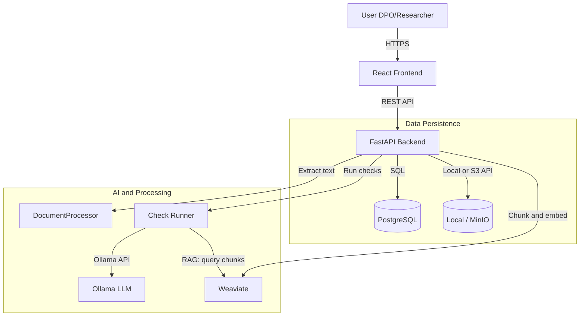

# System Architecture

## Technology Stack

The project follows a modern, containerized architecture (monolithic backend, separate frontend).

| Component | Technology | Description |
| :--- | :--- | :--- |
| **Frontend** | React (Vite) | SPA with Tailwind CSS and Radix UI. |
| **Backend** | FastAPI (Python) | REST API: business logic, DB, storage, LLM orchestration. |
| **Database** | PostgreSQL | Cases, Documents, Findings, Playbooks. |
| **Storage** | Local / MinIO (S3) | Configurable in `backend/app/storage.py`; object storage for document files. |
| **LLM Runtime** | Ollama | Local inference (e.g. Llama 3, Mistral); URL/model via env. |
| **AI Framework** | PydanticAI | Structured prompts and outputs in `backend/app/core/llm.py` and `services/check_runner.py`. |
| **Task Queue** | Celery + Redis | Async document extraction (Celery worker); upload returns 201 immediately. |
| **Vector DB (optional)** | Weaviate | Document chunks with embeddings (Ollama); used for RAG-based run-checks variant. |

## High-Level Data Flow

## Core Components

### 1. Case Service
*   **Location**: `backend/app/api/routes/cases.py`
*   **Entities**: `Case` (status, department, case_type, language, etc.), `ActivityLog` (Audit-Events pro Case).
*   **Responsibilities**: CRUD inkl. Löschen, Status-Übergänge, Assignee. Run-Checks-Endpoint implementiert (`POST /cases/{id}/run-checks`). Agent-Runs (Run-Checks) werden ausschließlich manuell ausgelöst (Button „Playbook-Checks ausführen“ in der Case-Detail-Seite); kein automatischer oder zeitgesteuerter Trigger. Audit-Log (`activity_log`) für Run-Checks und Finding-Status; `GET /cases/{id}/activities` für die Activity-Timeline im Frontend.

### 2. Document Service
*   **Location**: `backend/app/api/routes/documents.py`, `backend/app/services/document_processor.py`, `backend/app/storage.py`
*   **Entities**: `Document` (name, type, version, format, `storage_path`, `content`, optional `extraction_method`: `"text"` \| `"ocr"`).
*   **Responsibilities**:
    *   Upload → storage (local or MinIO) and DB record.
    *   Text extraction (PDF/DOCX/XLSX) on upload; result stored in `Document.content`. For PDFs with little extractable text (e.g. scanned documents), **OCR** runs automatically via Ollama Vision (configurable model, e.g. qwen2.5-vl); `extraction_method` is set to `"ocr"` in that case and shown in the frontend.

### 3. Playbook Engine
*   **Location**: `backend/app/api/routes/playbooks.py`, `backend/app/models/db.py` (`PlaybookModel`)
*   **Entities**: `Playbook` (name, version, JSONB `content`, case_type, department).
*   **Responsibilities**: CRUD for versioned playbooks; content is flexible JSON (e.g. list of checks). Standard-Playbooks liegen als YAML in `backend/app/data/playbooks/` und werden beim **ersten Start** automatisch importiert, wenn die Playbook-Tabelle leer ist (siehe `app/services/playbook_import.py`, Aufruf im `lifespan` in `main.py`). Optional: Umgebungsvariable `PLAYBOOKS_SEED_DIR` für alternatives Verzeichnis.

### 4a. Departments (Fachbereiche und zentrale Einrichtungen)
*   **Location**: `backend/app/data/fachbereiche.yaml`, `backend/app/api/routes/departments.py`
*   **Responsibilities**: Liste der Fachbereiche (FB 01–16) und zentralen Einrichtungen der Goethe-Universität; keine DB, Konfiguration aus YAML. `GET /api/v1/departments` liefert die Liste (code, label, type, value) für Dropdowns (z. B. Neuer Vorgang, Playbook-Zuordnung).

### 5. Check Runner / LLM Orchestrator
*   **Location**: `backend/app/core/llm.py`, `backend/app/services/check_runner.py`
*   **Responsibilities**:
    *   `llm.py`: PydanticAI agent with Ollama model.
    *   `check_runner.py`: Run a single check (document text + instruction) and return structured `CheckResult` (compliance, severity, evidence, recommendation). Findings can be persisted to the `findings` table. Supports two strategies: **full_text** (entire document text, truncated) and **rag** (relevant chunks from Weaviate, retrieved by embedding the check instruction). Both can run in parallel for comparison; findings carry `source_strategy` (`full_text` \| `rag`).

### 6a. Weaviate (optional)
*   **Location**: `backend/app/services/weaviate_service.py`
*   **Responsibilities**: After document text extraction (including OCR), content is chunked (configurable size/overlap), embedded via Ollama, and stored in Weaviate. On document or case deletion, chunks are removed (case deletion runs chunk removal in `asyncio.to_thread` so the API stays responsive). RAG checks embed the requirement, retrieve top-k chunks per document or per case, and pass only that context to the LLM. All Weaviate-related settings (backend and, when using docker-compose, the Weaviate container) are configured via `.env` / `.env.example`: `WEAVIATE_URL`, `WEAVIATE_INDEXING_ENABLED`, `WEAVIATE_CHUNK_SIZE_CHARS`, `WEAVIATE_CHUNK_OVERLAP_CHARS`, `WEAVIATE_TOP_K`, `OLLAMA_EMBEDDING_MODEL`, and optionally `WEAVIATE_PERSISTENCE_DATA_PATH`, `WEAVIATE_QUERY_DEFAULTS_LIMIT`, `WEAVIATE_CLUSTER_HOSTNAME`.

### 7. Storage
*   **Location**: `backend/app/storage.py`
*   **Backends**: `local` (filesystem under `storage_local_path`) or `minio` (S3-compatible). Configured via `STORAGE_BACKEND` and S3 env vars.

## Frontend (Kurzüberblick)

Die Oberfläche ist eine React-SPA (Vite), Seiten: Vorgänge (Cases), Case-Detail (Tabs: Übersicht, Dokumente, Findings, VVT, DSB-Report, Annotierte Dokumente, Aktivitäten), Playbooks, Playbook-Detail, Mein Profil, Verwaltung (Admin). Routing und API-Aufrufe zentral in `src/app/lib/api.ts`.

## Deployment

Designed for **on-premise** use with Docker Compose. Frontend, backend, Postgres, MinIO, Redis, and optionally Weaviate run in containers; Ollama is typically run on the host or another machine and reached via `OLLAMA_BASE_URL` (e.g. `http://host.docker.internal:11434`).
